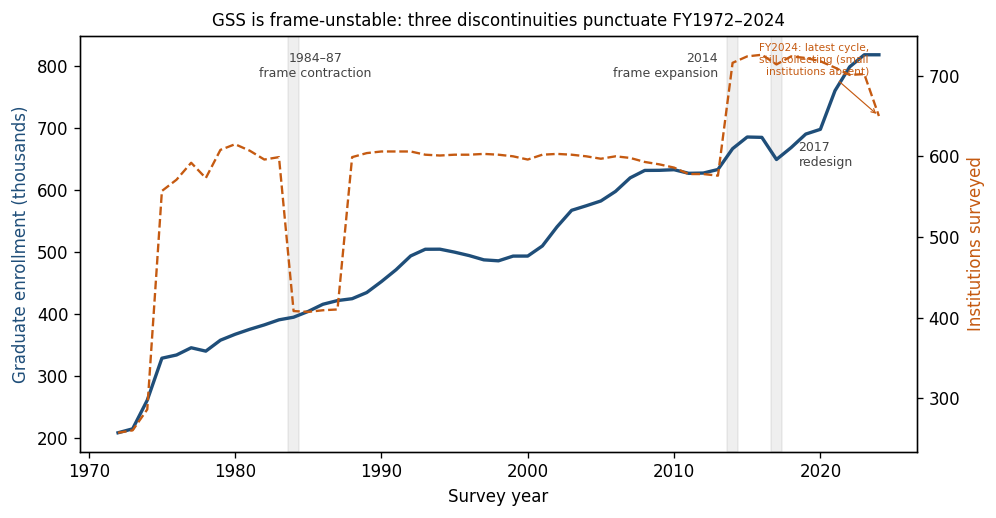
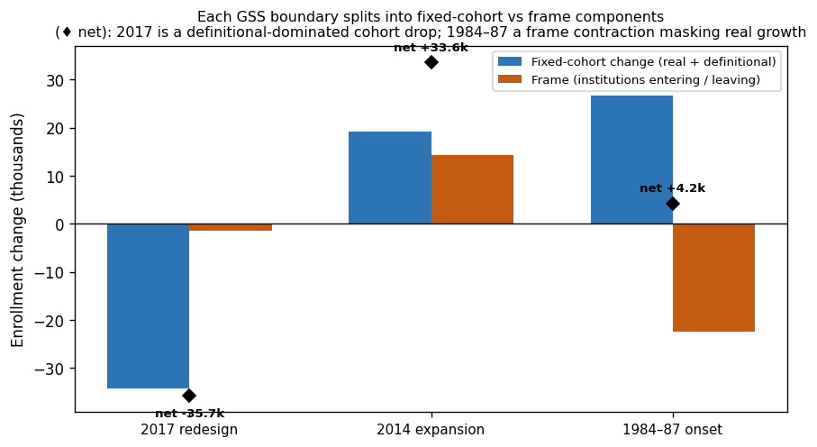
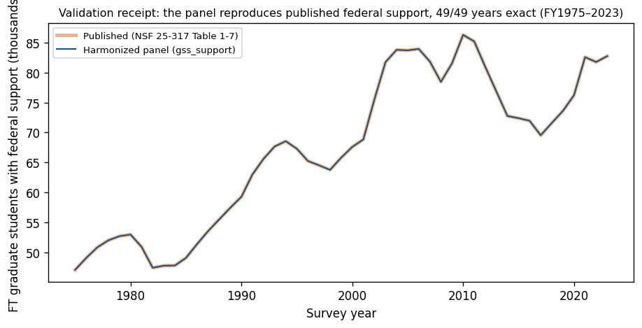

# Reconstructive Harmonization of the NSF GSS — methods note

*How the Survey of Graduate Students and Postdoctorates in Science and Engineering
(GSS) becomes a 53-year institution-year panel you can read across its
discontinuities — and how it joins the funding data already in this database.*

This note is for the cold reader: a data journalist, an institutional-research
director, a scholar who arrived here from a citation. It explains what the
harmonized GSS layer is, where the underlying survey breaks, what we did about each
break, and exactly how far to trust the result. Machine-readable artifacts (the
column crosswalks, the field-code map, the per-panel validation reports) are the
sources of truth and live in the appendix; this is the prose translation.

---

## 1. The problem: a survey that keeps changing its own shape

The GSS is an annual census of U.S. institutions granting research master's or
doctorates in science, engineering, and health. It is the richest institution-level
record of **who is being trained in research, and who pays for it** — but across 53
years it has repeatedly changed *which institutions it covers* and *what it counts*.

**Three discontinuities punctuate FY1972–2024.** The surveyed institution count
(orange) is not stable: it collapses by ~190 institutions in 1984, holds for four
years, snaps back in 1988; it jumps by ~140 in 2014; and in 2017 a full instrument
redesign drops measured enrollment 5.2% in a single year. A reader who differences
two GSS numbers across any of these lines, unaware, will mistake a survey change for
a real one. The rest of this note is about making that impossible.

(The smaller FY2024 dip in the institution line is *not* a fourth discontinuity: it
is the latest, still-collecting cycle — ~52 mostly-small institutions not yet in the
data, together under 1% of enrollment, while the core cohort is present and grew.
Treat FY2024 institution coverage as preliminary.)

## 2. What the harmonized GSS layer is

Three long-format panels, FY1972–2024, each keyed on the **native IPEDS UnitID**
the survey already carries (100% of rows, every year — there is no identity gap to
reconstruct, unlike HERD's pre-2010 era):

| Panel | What it carries | Rows |
|---|---|---|
| `gss_support` | full-time graduate students by **support mechanism × federal agency × federal/nonfederal** | 10.8M |
| `gss_race` | graduate students by enrollment-status × degree-level × gender × race | 12.7M |
| `gss_pd_nfr` | postdocs + non-faculty researchers (support, demographics, degree, citizenship) | 4.1M |

The grain is `unitid × year × field × …`; an omitted cell is a structural zero (the
survey reports a complete grid). `gss_support` is the **funding-of-human-capital
face**: it names, for each institution and field, how many full-time graduate
students are supported by NIH, NSF, DOD, DOE, USDA, NASA — the same federal agencies
HERD and FedSupport already track.

## 3. Reconstructive Harmonization: the three discontinuities, decomposed

Our method is not to bridge the breaks but to be precise about them: **reconstruct**
each era on its own terms (a), **decompose** what crossing the break involves into
named, sized components (b), and **publish what remains unmeasurable** (c). Each of
the three GSS discontinuities gets its own decomposition report (appendix); the
finding is that they are **different kinds of break**, and the figure says so.

**The 2017 redesign moved the count from *within* institutions, not *across* them:
of the −35,713 net, −34,254 is the same 708 institutions counting differently (definitional-dominated at the redesign — bounded 5–8%, the exact real-vs-definitional split inseparable; see clause-(c)) and only −1,459 is which institutions were
surveyed.** The 2016→2017
drop is the survey changing what it counts (and adding a master's/doctoral split that
is purely additive — post-2017 all-grad equals masters + doctoral exactly). By
contrast, **1984–87 is a frame contraction that masks real growth** (~190
institutions leave then return; underlying cohort enrollment grew +26,724 even as the
net stayed flat), and **2014 is a genuine expansion** (+19,215 real growth plus 147
new, mostly small institutions). The cold reader's rule follows directly: the
national enrollment series is safe across 1984–87, but the 2017 line must not be
differenced without the 5% definitional step, and institution-level work must treat
1984–87 as a reduced-coverage window.

What stays **unmeasurable (c)** is stated, not hidden: at 2017 the genuine-vs-
definitional split inside the fixed cohort cannot be separated without an external
referent (we bound the redesign's effect at 5–8% of the count basis); at 1984–87 the
cohort swings are partly reporting-unit reallocation; at 2014 a ≤10,621 "large-leaver"
term may be UNITID reassignment rather than true exit.

## 4. Validation: the panel reproduces published NSF totals exactly

Every panel reconciles to the published NCSES GSS 2023 statistical tables (NSF
25-317), staged and SHA-pinned as ground truth.

**The harmonized panel reproduces published federal graduate-support counts for all
49 years (FY1975–2023) with zero mismatches** — the blue line sits exactly on the
published orange. The 2023 cross-sections reconcile cell-for-cell too: federal
support by agency (NIH 23,172 / NSF 21,209 / …), the source split, the mechanism
split (`gss_support` vs Tables 1-6/1-7/1-8); total/FT/PT/sex/master's/doctoral
enrollment (`gss_race` vs Tables 4-3/1-2a); and postdoc totals, source, and
federal-by-agency (`gss_pd_nfr` vs Tables 1-9b/3-2/3-4). This exact agreement is also
what validates the project's acquisition decision — that the published XLSX
tabulation, read with the standard library and no new dependency, *is* the
authoritative source.

## 5. How GSS composes with HERD and FedSupport

GSS is the third face of one organizing picture — *where research funding comes from,
where it lands, and what it produces*. HERD records R&D **expenditure-out** by
institution and field; FedSupport records federal S&E **funding-in**; GSS records the
**people** that funding trains — federally-supported graduate students and postdocs,
by the same agencies, on the same **institution-year hub** (native UnitID, the
canonical key for all three). A reader can now ask, for a given institution and year,
how federal R&D dollars, federal S&E obligations, and federally-supported researchers
move together — the near-term funding-conversion question this database was built to
support.

## 6. Honest disclosure (clause (c))

- **Field names are provisional.** The dedicated NCSES Taxonomy-of-Disciplines /
  PUF field-code reference was not available at this release. We reconstructed
  `gss_code` → field by **count-matching** each code's 2023 enrollment to the
  published Table 4-3 — exact and unique for all **91 of 131** codes active in 2023.
  `field_fine` is the matched detailed field; `field_coarse` is the **Science /
  Engineering / Health super-broad only** (the finer ~10-way broad grouping awaits
  the reference). The **~40 historical-only codes are left NULL** — we do not invent
  mappings (codeset discipline). A later patch will confirm names against the TOD
  reference.
- **The boundary residuals** (§3) are bounded, not eliminated.
- **`gss_pd_nfr` carries overlapping marginal tables**, each tagged `measure_group`;
  sum within a group, never across (the support and demographic marginals
  independently total the same 65,850 postdocs — a built-in consistency check).

## Appendix — machine-readable sources of truth

- Column crosswalks: `crosswalks/gss/{support,race,pd_nfr}_column_map.csv`
  (every source column → canonical tuple, with `decision_rationale`).
- Field-code map: `crosswalks/gss/field_code_map.csv`.
- Per-panel validation (incl. the §5 anchor receipts): `validation/reports/gss/gss_{support,race,pd_nfr}_validation.md`.
- Boundary decompositions: `validation/reports/gss/gss_boundary_{2017,1984,2014}_decomposition.md`.
- Builders: `etl/acquire_gss.py`, `etl/build_gss_*_column_map.py`, `etl/build_gss_{support,race,pd_nfr}.py`, `etl/build_gss_field_code_map.py`; figures `etl/spikes/gss/gss_methods_figures.py` (charts dev-group).
- Published ground truth: NSF 25-317 tables, SHA-pinned in `data/reference/MANIFEST.md`.
