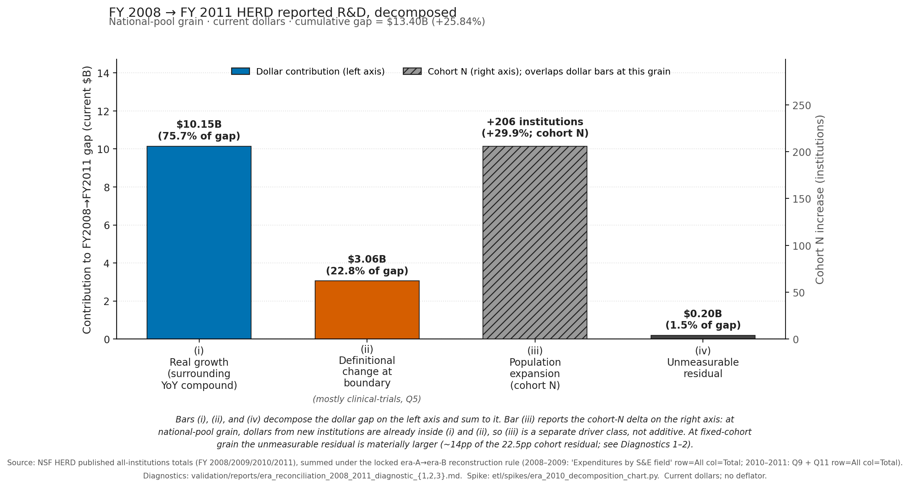

# Reconstructive Harmonization: Reading the 2010 HERD Format Break

**Series:** Methods notes for the quadrivium HERD harmonized panel deposit.
**Authored:** 2026-05-01 (HD 2.1.i).
**Scope:** the 2010 era boundary in NSF's Higher Education Research and Development survey, the era-B reconstruction rule that recovers all-source field-level totals from the post-2010 source-class fragments, and the four-driver decomposition of the discontinuity itself.
**Companion artifact:** `data/harmonized/herd_panel.parquet` (1975–2024, 50-year field-level expenditure panel, two parallel reconstructed series).

---

## 1. The 2010 cliff: a silent break in 38 years of field-level data

**Figure 0.** *HERD survey question count by year, 1972–2024.*


> *In a single year, NSF's 2010 redesign jumped HERD from 7 questions to 19 — and silently broke 38 years of field-level longitudinal continuity for users who don't know to look.*

In 2010, NSF replaced the Academic R&D Expenditures Survey with the Higher Education R&D survey. The instrument went from 7 questions to 19 in a single year, with no question-name overlap. The single field-level question that anchored 1973–2009 — `Expenditures by S&E field`, one all-source dollar value per institution × field — was removed. In its place arrived a federal-source question (Q9) and a nonfederal-source question (Q11), each reporting field-level dollars by funding agency or source class.

For a longitudinal user pulling the same column header across years, the 2010 file simply has different headers. There is no transitional year where both schemas overlap; the 2010 file fingerprint is era-B-only. *That is the cliff.* It is not a noisy boundary that careful reading can smooth. It is a clean discontinuity in what NSF asks institutions to report, and 38 years of field-level analyses sit on the older side of it.

Most users meet the cliff by stopping at 2009. The deposit this methods note accompanies treats the cliff as a problem with structure: era B can be put back together on its own terms, the boundary itself can be quantitatively decomposed, and both can be published as separate, non-bridged artifacts. We call this **Reconstructive Harmonization**, and this methods note is the worked example.

> Question count by year is reproduced in `docs/herd_question_structure_by_year.csv`; the 2010 row carries `distinct_question_count = 19` and is the first year with `era_a_question_present = false`.

---

## 2. The decomposition: a 26% jump that is mostly real growth

**Figure 1.** *FY 2008 → FY 2011 HERD reported R&D, decomposed.*



> *At the 2010 HERD format break, what looks like a 26% jump decomposes into real growth ($10.2B, 76%), a definitional change at the boundary ($3.1B, 23%, mostly clinical-trials), and a ~30% wider survey net — leaving $0.2B unexplained at this grain.*
>
> *Bars (i), (ii), and (iv) decompose the dollar gap on the left axis and sum to it. Bar (iii) reports the cohort-N delta on the right axis: at national-pool grain, dollars from new institutions are already inside (i) and (ii), so (iii) is a separate driver class, not additive. At fixed-cohort grain the unmeasurable residual is materially larger (~14pp of the 22.5pp cohort residual; see Diagnostics 1–2).*

The headline number — HERD-defined national R&D rose 25.84% in current dollars between FY 2008 and FY 2011 — does not survive close reading as a single quantity. Three drivers contribute to the gap, and a fourth piece of it is residual we cannot close from HERD microdata alone.

**Driver 1 — real macro growth (~76% of the gap).** Year-over-year national-pool growth was +5.77% (FY 2008→2009), +11.71% (FY 2009→2010), +6.51% (FY 2010→2011). The middle year carries the largest single jump and overlaps the era boundary; the surrounding years bracket it with growth rates that are macroeconomically plausible. Compounding the 2008→2009 and 2010→2011 rates as the surrounding-year baseline and applying it across the boundary yields ~$10.2B of the $13.4B gap.

**Driver 2 — definitional change at the boundary (~23% of the gap, mostly clinical trials).** Per FY 2024 HERD Methodology Guide pages 80–83 and 630–633, era B "explicitly included clinical trials and research training grants" in the R&D definition that era A did not. Q5 in era B carves out clinical-trial R&D as an institution-year attribute; the median Q5 share across our top-10 sample is 1.98% in FY 2010 and 1.86% in FY 2011. The training-grants component of the definitional shift is **not separately measurable from HERD microdata** — there is no era-B question that isolates it. Closing that part of the residual requires NIH RePORTER or NSF Award Search data joined at the institution-year level, which sits outside HD 2.1's scope.

**Driver 3 — survey-population expansion (a separate driver class, not additive).** The HERD respondent pool grew from 690 institutions in FY 2008 to 896 in FY 2011, a +29.9% cohort-N expansion. At national-pool grain, dollars from new institutions are already inside drivers 1 and 2, so the cohort delta is reported on the right axis of Figure 1 as a separate class — it explains *why* the national pool is larger but does not add a fourth dollar bucket to the left-axis sum. At fixed-cohort grain the picture is different: the same 10-institution cohort residual (Diagnostic 1) is −22.5% over 2008→2011, and the unmeasurable residual is materially larger (~14 percentage points of the 22.5pp gap remain after subtracting clinical-trials and Diagnostic-3-style real growth at fixed-cohort grain).

**Driver 4 — bounded unmeasurable residual (~1.5% of the gap at national-pool grain).** What remains after the three named drivers — $0.2B at national-pool grain, larger at fixed-cohort grain — is what we cannot decompose further from HERD alone. We name this rather than attribute it to "noise."

The contribution claim is precise: *we did not bridge the 2010 boundary; we decomposed it.* Real growth and definitional change are sized; cohort expansion is reported on a different axis; the residual is bounded and named. The deposit ships two parallel reconstructed series with the boundary documented, not a single concatenated time series.

---

## 3. Validation: structural verdict, six W5 cells pre-doc'd, one institutional anomaly

The era-B reconstruction rule (§4 below) was tested against era-A direct field-level totals at the institution × coarse-bucket grain on the top-10 institutions by FY 2008 R&D, comparing year-pair 2009→2010 (adjacent) and 2008→2011 (long-gap sanity). The full report sits in `validation/reports/era_reconciliation_2008_2011.md`; the summary follows.

The HD 1.4 threshold ladder applied at the cell-counting grain (n = 63 non-pre-doc, non-missing cells) returns a **Structural** verdict: ~46 of 63 cells fall outside the [0.95, 1.05] ratio band; five cells fall outside the [0.5, 2.0] extremity band; the era-A-to-era-B question mapping is many-to-many at the question level (era A's single field-level question fragments into Q9 and Q11). Any one of these triggers alone would suffice. This verdict is documentation only — the methods-note framing is locked at *decomposition*, not *transparent crosswalk*, and no framing change is triggered. The Structural verdict reflects the 2010 redesign as a redesign; what the methods note adds is the rule for reading across it.

Six cells (every Environmental sciences → Geosciences pairing across the top-10 institutions) were pre-documented as W5 definitional-drift cells before the residual gate ran. Their residuals are reported but do not count against the reopen triggers, because their cause was diagnosed in advance and the rename + scope expansion is documented in the discipline crosswalk.

**The Duke anomaly is named explicitly.** Duke University's Q5 clinical-trials share (32.25% in FY 2010 / 32.59% in FY 2011) exceeds Duke's institution-total residual (−22.14% / −33.29%). One reading: era A captured some of Duke's clinical-trial dollars at the institution-total grain that era B's Q5 also captures, so clinical trials are not entirely net-new at the era boundary for Duke. Another: Duke's Q5 reporting includes activity beyond the strict FY 2024 Guide page 14 clinical-trials definition. Either reading complicates the clean "Guide page 14 explains the definitional drift" account. We flag this as a known per-institution complication; we do not lean on Guide page 14 as a full account of definitional drift.

**Population scope.** All-respondents reconciliation (matching the published HERD InfoBriefs headline). Standard-form-only reconciliation (NCSES Data Table 26 universe) is HD 2.7 work and is not folded into this report.

**Threshold provenance.** The 5%/15% bucket-median and cell-residual thresholds are descriptively grounded against practitioner reporting-noise priors. We canvassed NCSES, NSF Science & Engineering Indicators NSB-2025-7, ASEE Engineering by the Numbers, and academic literature for a published numerical tolerance for the 2010 boundary; none surfaced — NCSES guidance on the boundary is qualitative ("exact comparisons may be misleading; contact NCSES").

---

## 4. The era-B reconstruction rule (Q9 + Q11, all-source-internal)

For every (institution, year, field) cell in era B (2010–2024), the all-source field-level R&D total is reconstructed as:

> **all_source_total(field, year) = Q9.column['Total'](field, year) + Q11.column['Total'](field, year)**

— where Q9 is *Federal expenditures by field and agency* and Q11 is *Nonfederal expenditures by field and source*. Both components use the rolled `Total` column, which sums across the agency and nonfederal-source axis. The rule sums across the federal/nonfederal axis (the axis era-B fragmented); it does not sum across the discipline axis, and each (institution, year, field) row is reconstructed independently.

Four other questions might at first look like additional components. Each is excluded for a specific reason, locked in CLAUDE.md §6:

- **Q14 — Capitalized R&D equipment expenditures by field.** A subset of Q9 + Q11, not a separate component. Including it would double-count the equipment portion already inside the federal/nonfederal totals. Q14 ships in the harmonized panel as a parallel `expenditure_type='r&d_equipment'` row, paralleling era-A Item 3. Equipment rows ship at `source_class='all_source'` only — neither era-A Item 3 nor era-B Q14 carries a federal/nonfederal split at the field-level grain, so a consumer filtering `expenditure_type='r&d_equipment' AND source_class='federal'` gets zero rows by construction.[^equip-boundary]
- **Q4 — Medical school R&D expenditures, and Q5 — Clinical trial R&D expenditures.** Carve-outs from the institution-year R&D total, not separate components. Both ship as institution-year attributes (`med_school_share`, `clinical_trials_share`). Q5's raw HERD label is `Clinical trials`; the FY 2024 Guide canonical is `Clinical trial R&D expenditures` — build code joins on the raw form.
- **ARRA federally financed R&D (2010–2014, removed FY 2015).** A within-federal sub-stream of Q9, not a parallel federal component. Build assumption is case-(a): no ARRA add to the rule. Empirical confirmation comes from the residual report; if a federal-heavy bucket reopens with a sign that traces to ARRA, the disposition reopens.
- **Q9's per-agency columns vs. column='Total'.** Era B replaces era A's single rolled `column='Federal'` with seven agency columns (DOD, DOE, HHS, NASA, NSF, USDA, Other agencies) plus a rolled `Total`. The rule uses `column='Total'`, sidestepping the agency-rollup question entirely. Agency-level reconstruction is a separate, federal-only question outside this rule.

**The non-bridge clause is load-bearing.** This rule is era-B-internal. It reconstructs era-B all-source field-level totals from Q9 + Q11 fragments for 2010–2024. *It does not bridge era A to era B.* The era boundary at 2010 is characterized as decomposed (§2), not bridged. The deposit ships two parallel reconstructed series — era-A direct (1973–2009) and era-B reconstructed (2010–2024) — plus the decomposition. It does not ship a single bridged series, and chart code that joins `era_a_value(disc, year≤2009)` onto `era_b_reconstructed(disc, year≥2010)` as a single time series is a contract violation against this clause. The harmonized panel preserves the era boundary as a column (`era ∈ {'A','B'}`); chart consumers read both eras and render them as distinct series.

The rule and its dispositions are reproduced verbatim in Appendix B. The full per-question disposition table is in Appendix A.

---

## 5. Cross-grain caveats: the residual is not one number

The decomposition in §2 reports the same drivers at two grains, and the magnitudes differ. The methods note's contribution depends on naming the difference clearly.

**National-pool grain (Figure 1).** Cumulative FY 2008→2011 growth in HERD-defined national R&D = +25.84% in current dollars. Real growth ≈ $10.2B (76%); definitional change ≈ $3.1B (23%, mostly clinical trials at ~25% of the adjacent-year gap); cohort expansion 690→896 institutions reported on the right axis as a separate driver class; unmeasurable residual ≈ $0.2B (1.5%). Cohort dollars are inside drivers 1 and 2; (iii) is not additive to the dollar bars.

**Fixed-cohort grain (top-10 institutions, Diagnostic 1).** Median institution-total residual = −7.62% (2009→2010 adjacent) and −22.49% (2008→2011 long-gap). Sign-consistent across all 10 institutions at the long-gap pair (10/10 era-B > era-A); 8 of 10 at the adjacent pair. Q5 clinical-trials share (Diagnostic 2): median 1.98% (2010), 1.86% (2011). The unexplained-by-clinical-trials portion of the residual: +6.19pp at adjacent, +16.94pp at long-gap. At fixed-cohort grain the unmeasurable residual is materially larger than at national-pool grain — roughly 14pp of the 22.5pp gap remains after subtracting clinical-trials and surrounding-year real growth.

The two grains measure different things and are not directly additive. The residual is national-pool growth minus surrounding-year real growth; it is fixed-cohort era-B reconstruction minus era-A direct. The methods note's contribution is to publish both, name the gap, and refuse to collapse them into a single "structural drift" number.

**What HERD alone cannot decompose.** The split between (1) real R&D-spending growth and (2) era-B definitional expansion at fixed-cohort grain. We have HERD-defined growth (which already bakes in the era-B definition) but no era-A-equivalent FY 2010+ recomputation of dollars under the older R&D definition. A "real growth net of definitional change" series would require either external data (BEA / NIPA R&D-by-sector for higher ed, with caveats) or a same-population-same-rule recomputation that HD 2.1 is not in scope to build. Per FY 2024 Guide page 14, training grants are HERD-unmeasurable as a separate component; closing that part of the unmeasurable residual requires NIH RePORTER or NSF Award Search joined to institution-year. We name the limit; we do not claim to have crossed it.

---

## 6. What the deposit ships

Two parallel reconstructed series, one boundary characterization, supporting infrastructure:

1. **Era-A direct field-level expenditure series, 1975–2009 (35 years).** Read directly from era A's `Expenditures by S&E field` question, `column='Total'`. FY 1972–1974 are preserved in the raw deposit artifacts but excluded from the field-level panel via the `PANEL_FIRST_YEAR=1975` floor: FY 1972 carries no field-level question, and FY 1973–1974 emit a Guide-undocumented `status='c'` code on field-level `column='Total'` rows.[^fy7274-carveout] Pre-1981 era-A field-list variability across sub-fingerprints does not affect the row-level data values, but it does shape which leaf rows are visible in the pre-1979 window.[^pre1981]
2. **Era-B reconstructed field-level expenditure series, 2010–2024 (15 years).** Reconstructed via the Q9 + Q11 rule (§4) at the (institution, year, discipline_fine) grain.
3. **The boundary characterization, this methods note.** Decomposition figure (Figure 1), per-driver detail (§2), validation report and three diagnostics (§3, Appendices D–G), the rule itself (§4, Appendix B), cross-grain caveats (§5).
4. **Discipline crosswalks.** `crosswalks/discipline_coarse.csv` (18 rows, full table in Appendix C), `crosswalks/discipline_fine.csv` (96 rows, summary by coarse bucket in Appendix C with full table cited by-path).
5. **Question map.** `crosswalks/question_map.csv` (36 rows, summary in Appendix A) — one row per (era, year_range, question) with disposition and decision rationale. The era-B reconstruction rule is consistent with the per-row dispositions; the YAML and CSV agree on era_role and contributes_to_all_source_total for every question.

What the deposit does **not** ship: a single bridged 1973–2024 time series; a deflated panel (BEA GDP-R&D price index application is HD 2.5 work, not HD 2.1); a standard-form-only reconciliation (HD 2.7 work, against NCSES Data Table 26's $1M-FY23-R&D universe). Each is a deliberate scope boundary, not an oversight.

**Reading grain — the `*, all` rollup vs. the leaves.** Both era-A `Expenditures by S&E field` and era-B Q9/Q11 carry, for each coarse bucket, a rolled row (`row='Engineering, all'`) *and* the underlying leaf rows (`row='Engineering, civil'`, and so on). The harmonized panel ships both, because both carry signal — the rollup is the canonical bucket total, the leaves are its disaggregation. The consumer convention follows: compute bucket-level totals from the `*, all` rollup (filter `discipline_fine LIKE '%, all'`), and compute leaf-level aggregates from the leaves with the rollups excluded. Summing a rollup *and* its leaves double-counts; at the broad-field grain it roughly doubles the value. The rollup is also the stable comparison surface across the 2010 redesign's fine-leaf shifts: the instrument changed which fine fields exist and how they nest, but the broad-field rollup is invariant to that churn in a way the leaves are not. The FY 2024 verification anchor reconciles at the rollup grain for exactly this reason (`validation/reports/panel_anchor_reconciliation.md`).

**NULL semantics and the `quality_flag` column.** HERD's raw CSVs encode missing-value semantics through a combination of row-presence and a `status` column. Per the FY 2024 Guide (pages 8 and 23), a leaf-level row appears only when the institution's reported value is nonzero — so row-absence at a (institution, discipline, source-class) cell is the documented encoding for zero R&D in that cell, not a missing-data signal — while total rows always emit a record. The harmonized panel preserves status provenance through a `quality_flag` column on every row: `'reported'` for blank-status rows (~97% of FY 2024 Total-column cells), `'imputed'` for NSF-imputed rows (`status='i'`, ~3% at FY 2024), `'estimated'` for the era-A `status='e'` code (FY 2024 Guide page 25; effectively retired in practice), and `'unspecified_zero'` for raw `status='u'`. (The Guide additionally documents `status='n'`, data not available, per pages 10 and 25; it does not appear at any in-scope Total-column cell.) The Guide documents `'u'` as a valid code; its empirical scope — roughly 4,000 rows across era-B FY 2010–2022, 106 institutions, retired in FY 2023+ — is characterized in `validation/reports/herd_null_characterization_findings.md`, and its footprint on the shipped panel is 9 rows at FY 2020 Q14 for one institution (South Carolina State University). Pre-1990 era-A files emit status codes in mixed case (`'I'`/`'E'` alongside `'i'`/`'e'`); the build case-folds to the documented lowercase codeset. The era-B reconstruction rule (§4) propagates the least-good of the two component flags onto each reconstructed all-source row, with a row-absent side contributing a zero to the value and no flag. A consumer who wants institution-reported values only can filter on `quality_flag='reported'`; the default deposit view includes imputed values, consistent with NSF's published national totals.

### Reproducibility under publication-regime drift (locked 2026-05-10)

Operational data publication regimes drift independently of the underlying data; verification-anchor selection has to account for regime stability, not just data availability. NSF reduced FY 2024 HERD DST from 86 PDFs to 55 and pushed Tables 28–54 (engineering subfield rankings, agency-specific rankings) to the NCSES Table Builder interactive tool — Table-Builder-only, no static PDF. The data scope was unchanged; the static-anchor architecture wasn't. The deposit's reproducibility contract faces the regime change explicitly: a hybrid anchor architecture, with static PDFs where the publication regime supports them and Table Builder CSV snapshots where it does not, with per-cell anchor source documented. This extends Reconstructive Harmonization clause (a) — reconstruct what each era can support on its own terms (§7) — to the verification-anchor layer. Each anchor is reconstructed against the publication regime in effect at staging time, not against an idealized PDF surface that no longer exists.

A cold reader reproducing the verification grid consumes the staged Table Builder CSV snapshots directly as the canonical anchor; a paired query-parameter YAML sidecar (mirroring the documentation discipline of `crosswalks/era_b_reconstruction_rule.yaml`) captures the exact Table Builder query parameters so the live tool can be re-queried and reconciled against the snapshot while the NSF tool persists. The Table Builder CSV snapshot is the canonical anchor for this verification — NSF may evolve the Table Builder interface; if the live tool's behavior diverges from the snapshot, the snapshot remains the deposit's reproducibility contract. The full mechanism (per-spot-year anchor-source table, seven-item staging discipline, two-tier re-verification path, query-parameter YAML schema) is in `docs/methods_notes/herd_panel_etl_scoping.md` §2(d.1)/(d.2)/(e); the seed-level claim that publication-regime stability is a fourth axis of operational-data discontinuity (alongside taxonomy redesign, encoding pipeline drift, and back-applied universe filters) is at `seeds/research-seeds.md` 2026-05-10.

The FY 2024 verification anchor staged 2026-05-21 (`data/reference/dst-table-builder/dst-table-builder-FY2024.csv`; sidecar at `data/reference/dst-table-builder-FY2024-query.yaml`)[^dst-fy24-nav] surfaces a substrate-shape finding parallel to the publication-regime drift. The grid is 60 cells nominal (10 institutions × 3 disciplines × 2 source classes), 58 substantive: UCSF participates in HERD as a comprehensive R&D-performing institution but lacks an Engineering substrate, so both UCSF Engineering cells (federal and nonfederal) are structurally absent in the export. UC system Engineering R&D lives at Berkeley, San Diego, Los Angeles, Irvine, and Davis, not San Francisco — the absence is not suppression, not a disclosure-rule artifact, and not a documented zero. It is the cohort's substrate composition speaking through the cell-count: a 10-institution cohort does not imply 10-institution coverage of any given discipline. Where the publication-regime axis says the static-anchor architecture for the verification grid is heterogeneous across spot years (some cells in PDFs, others in Table Builder snapshots), the substrate axis says the cohort itself is heterogeneous across institutions (some cells are present, others are structurally absent at the institution level). The grid's cell count is not derivable from cohort × discipline × source-class multiplication alone — it requires institution-level substrate verification, and the verification grid contracts honestly to what the substrate supports. The receipt — the institution-level diagnosis, the 9 + UCSF × 4 = 58 arithmetic, and the Path A disposition — lives in the sidecar's `notes.empirical_grid_composition` block.

---

## 7. Reconstructive Harmonization, the methodological signature applied

Reconstructive Harmonization is the program's owned-term framing for how we work across data discontinuities. It has three clauses:

- **(a) Reconstruct what each era can support on its own terms.** Era A's 1973–2009 field-level dollars are read directly from its single field-level question; era B's 2010–2024 field-level dollars are reconstructed from Q9 + Q11 within era B (§4). Each era is reconstructed against its own instrument, not against the other.
- **(b) Decompose what crossing the discontinuity actually involves.** The 2010 boundary is decomposed into real growth, definitional change, cohort expansion, and bounded unmeasurable residual (§2 and Figure 1). Driver magnitudes are reported at two grains; cross-grain caveats are explicit; what HERD alone cannot decompose is named (§5).
- **(c) Publish both with sufficient documentation that a cold reader can use either without misreading the discontinuity.** This methods note plus the parallel-series deposit and the rule artifacts (Appendices A–C) constitute the documentation. The non-bridge clause is the consumer contract.

Reconstructive Harmonization is not a bridge. It is a discipline for being honest about what reconstructs cleanly within an era, what decomposes across the boundary, and what remains residual. The 2010 HERD break is one application; the program's other discontinuities (era-A pre-1981 field-list variability, era-B FY 2017 micro-expansions, the personnel sibling deposit's Q15/Q16 schema change at FY 2020) inherit the same framing. §8 below is the worked personnel application — smaller scope, same (a)/(b)/(c) pattern.

---

## 8. Personnel sibling — Q15 headcount + Q16 FTE

The financial spine of this methods note ends at §7. The personnel sibling deposit (`data/harmonized/herd_personnel.parquet`, paired with `data/harmonized/herd_panel.parquet` per CLAUDE.md §6) ships against the same Reconstructive Harmonization framing on a smaller surface area. This section integrates the personnel-specific decisions; the deposit-level README at `docs/methods_notes/herd_personnel_README.md` carries the cold-reader artifact summary.

### 8.1 Scope

**Era-B-only.** Q15 (Headcount of research personnel) and Q16 (Full-time equivalents of research personnel) are era-B-internal questions; no era-A counterpart exists. The 2010 HERD redesign added research-personnel reporting that the 1972–2009 instrument did not collect at this level. Within era B, Q15 first appears at FY 2010 in aggregate-only form; Q16 first appears at FY 2020. The era boundary at 2010 is therefore not the relevant discontinuity for personnel; the relevant discontinuity is the **published-vs-microdata split at FY 2022**.

**Year coverage.** Published Table 26 totals span FYs 2020–2024 (5-year longitudinal). Per HD 1.2, the public-use microdata carries Q15/Q16 rows for FYs 2022–2024 only; FYs 2020–2021 are aggregate-only. The personnel parquet covers the microdata-bearing years 2022, 2023, and 2024 (~14,859 rows).

### 8.2 Schema

Parallels the financial panel in spirit; diverges on value axis. The financial panel's `expenditure_type` and `value_type ∈ {current, constant}` columns are not meaningful for headcounts — there is no clinical-trials carve-out parallel, no deflator, no per-source-class fragmentation. In their place the personnel schema carries `measure_type ∈ {headcount, fte}` and `personnel_function ∈ {researchers, technicians, support_staff, total}`. The discipline axis is dropped (Q15/Q16 carry no field-level disaggregation in the public-use file). Era is constant `'B'` but retained so the schema reads as a parallel of the financial panel.

The decision is locked in CLAUDE.md §6 paired-deposit framing: *"Same provenance, same harmonization decisions, separate artifacts because the question types don't share a value axis."* The 15-column schema is enumerated in the personnel README.

### 8.3 Reconstructive Harmonization clauses applied to personnel

The (a)/(b)/(c) pattern applies on a smaller surface than the financial deposit, but it applies cleanly. The discontinuity here is conceptual rather than chronological — the public-use microdata's all-respondents universe vs. NCSES Data Table 26's standard-form-population universe.

**(a) Reconstruct what each era can support on its own terms.** Era B is the only era with personnel data; the question is what the public-use microdata can report on its own terms. The parquet preserves every Q15/Q16 row from the microdata (filter-free, ~14,859 rows across 2022–2024) and aggregates institution × year × function × measure into the long-format schema above. No reconstruction rule analogous to the financial Q9 + Q11 sum is needed — Q15 and Q16 are each rolled to a `column='Total'` that already aggregates the personnel-function axis.

**(b) Decompose what crossing the discontinuity actually involves.** The discontinuity for personnel is conceptual: the all-respondents universe of the public-use file vs. the standard-form population ($1M+ FY 2023 R&D) of NCSES Data Table 26. Decomposed:

- **FY 2024 exact (filter aligns by construction).** Table 26's standard-form criterion is "$1M+ in FY 2023." The public-use FY 2024 reporting institutions are by construction the institutions that completed the standard-form survey in FY 2024 — i.e., the FY-2023-anchored backstop set. FY 2024 free-sum equals Table 26 FY 2024 to within rounding.[^fy24-rounding]
- **FY 2022/2023 documented divergence (filter back-applies).** Table 26's FY 2022 and FY 2023 cells include only institutions that reported $1M+ in FY 2023 — the criterion is FY-2023-anchored *across all five years* of the longitudinal, not re-evaluated per year. The public-use file does not pre-apply that backstop in retrospective years. The result is a +0.46% to +0.88% positive drift (parquet free-sum > Table 26) at FY 2022/2023, in the same direction across both years and both measures, structurally consistent with exactly this filter mechanism.

The receipts (cell-by-cell Headcount + FTE for the three years, sign-consistency, structural argument) are in `validation/reports/personnel_table26_reconciliation.md`. The headline framing carried by this section is the panel-locked verdict:

> **FY 2024 exact match; FY 2022/2023 documented divergence ~0.46–0.88% structurally explained by FY-2023-anchored standard-form filter back-applied to all years.**

**(c) Publish both with sufficient documentation that a cold reader can use either without misreading the discontinuity.** The deposit ships the all-respondents view; cold readers who want Table 26 alignment filter the parquet to the FY-2023-anchored standard-form respondent set. The README and this section together carry that contract; the reconciliation report carries the receipts. Public-use response rate is 99.40–99.85% across 2022/2023/2024 against the standard-form survey universe per Table A-3 (`data/reference/nsf26304-taba-003.pdf`), as a complementary completeness cross-check on the inventory side — A-3 publishes the surveyed universe (a different concept than Table 26's respondent total) and is not a parallel reconciliation anchor.

### 8.4 What the personnel sibling does not ship

A standard-form-filtered companion view (the deposit ships the all-respondents view filter-free, by Phase 1 design choice — preserves three downstream options: reconciliation, all-respondents views, future publications with different population definitions). Year coverage outside 2022–2024 (the public-use microdata does not carry per-institution rows for FYs 2020–2021; consumers needing those years read Table 26 directly). Discipline-level personnel disaggregation (Q15/Q16 are institution-total only). Demographic detail (sex, citizenship, education) is not released in the public-use file per FY 2024 Guide §1.2.

### 8.5 Pointers

- Cold-reader artifact summary and schema: `docs/methods_notes/herd_personnel_README.md`.
- Verification receipts (6-cell grid, structural argument, A-3 cross-check): `validation/reports/personnel_table26_reconciliation.md`.
- Builder + verifier: `etl/build_herd_personnel.py`, `etl/spikes/personnel_table26_verify.py`.
- Anchors: `data/reference/nsf26304-tab026.pdf` (Table 26), `data/reference/nsf26304-taba-003.pdf` (Table A-3), `data/reference/nsf26304-taba-023.pdf` (table inventory).

---

## Appendix A — Question map (`crosswalks/question_map.csv`)

The full machine-readable table is at `crosswalks/question_map.csv` (36 rows, 8 columns including `decision_rationale`). The summary below collapses to per-question disposition; the era-B all-source rule consumes the two rows marked `contributes_to_all_source_total = true`.

| era | year_range | question | era_role | contributes_to_all_source_total | column_used |
|---|---|---|---|:---:|---|
| A | 1973–2009 | Expenditures by S&E field | era-A-direct | true | Total |
| A | 1981–2009 | Current fund research equipment expenditures by field | era-A-direct | false | Total |
| A | 1972–2009 | Academic R&D expenditures by source | era-A-attribute | false | — |
| A | 1997–2009 | Academic R&D expenditures passed through to subrecipients | era-A-attribute | false | — |
| A | 2000–2009 | Academic R&D expenditures received as a subrecipient | era-A-attribute | false | — |
| A | 2003–2009 | Expenditures by non-S&E field | era-A-attribute | false | — |
| A | 2003–2009 | Expenditures by field and agency | era-A-attribute | false | — |
| A | 1979–1989 | Capital expenditures by area | era-A-attribute | false | — |
| A | 2009 | R&D projects awarded | era-A-attribute | false | — |
| B | 2010–2024 | Federal expenditures by field and agency (Q9) | era-B-all-source-component | **true** | Total |
| B | 2010–2024 | Nonfederal expenditures by field and source (Q11) | era-B-all-source-component | **true** | Total |
| B | 2010–2024 | Capitalized R&D equipment expenditures by field (Q14) | era-B-subset-of-Q9+Q11 | false | — |
| B | 2010–2014 | ARRA federally financed R&D expenditures | era-B-subset-of-Q9+Q11 | false | — |
| B | 2010–2024 | Medical school R&D expenditures (Q4) | era-B-attribute | false | — |
| B | 2010–2024 | Clinical trial R&D expenditures (Q5) | era-B-attribute | false | — |
| B | 2010–2024 | Other federal agency detail (Q10) | era-B-attribute | false | — |
| B | 2010–2024 | R&D expenditures by character of work (Q6) | era-B-attribute | false | — |
| B | 2010–2024 | Headcount of research personnel (Q15) | era-B-attribute | false | — |
| B | 2020–2024 | Full-time equivalents of research personnel (Q16) | era-B-attribute | false | — |
| B | various | (16 additional era-B-attribute and short-form rows) | era-B-attribute | false | — |

Per-row decision rationale is in the source CSV.

---

## Appendix B — Era-B reconstruction rule (verbatim from `crosswalks/era_b_reconstruction_rule.yaml`)

```yaml
# Era-B Reconstruction Rule
#
# Source of truth for the cross-question summation that reconstructs era-B
# all-source field-level R&D totals from Q9 (federal) + Q11 (nonfederal)
# fragments within era B (2010-2024). Consumed by `etl/build_herd_panel.py`
# (HD 2.4); lifted verbatim into `docs/methods_notes/reconstructive_harmonization.md`
# Appendix B (HD 2.1.i).

rule_id: era_b_reconstruction_v1
rule_name: "Era-B all-source field-level reconstruction (Q9 + Q11)"
authored_at: "2026-05-01"
authored_by: "Skipper (HD 2.1.b-yaml)"

scope:
  era: B
  year_range: [2010, 2024]
  unit: kUSD_current
  grain: "(institution_id, year, discipline_fine)"
  bridges_to_era_a: false
  discontinuity_at: 2010
  discontinuity_characterization_doc: "docs/methods_notes/reconstructive_harmonization.md"
  discontinuity_characterization_section: "slot 2 four-bar decomposition"

# -- The rule itself --------------------------------------------------------
#
# For era B (2010-2024), the reconstructed all-source field-level total is:
#
#     all_source_total(field, year)
#         = Q9.column['Total'](field, year)        # federal, all-agencies
#         + Q11.column['Total'](field, year)       # nonfederal, all-sources
#
# Both components use column='Total' (the rolled column that sums across
# the agency / nonfederal-source axis). The rule sums across the federal /
# nonfederal axis because that is the axis era-B fragmented; it does NOT
# sum across the discipline axis (each (institution, year, field) row is
# reconstructed independently).
#
# This rule is era-B-internal. It does NOT bridge to era-A's direct
# `Expenditures by S&E field` total (1973-2009). See `non_bridge_clause`.

components:

  - role: all_source_total
    formula: "Q9.column['Total'] + Q11.column['Total']"
    components_in:
      - question: "Federal expenditures by field and agency"
        question_short: "Q9"
        column: "Total"
        fy24_guide_anchor: "page 5"
        fy24_guide_quote: |
          "Question 9A-K requested that institutions report the amount of
          their R&D expenditures by field that was funded by federal agency
          sources (i.e., the U.S. Departments of Agriculture, Defense,
          Energy, and Health and Human Services; the National Aeronautics
          and Space Administration [NASA]; NSF; and all other federal
          agencies)."
        question_map_csv_row: "B,2010-2024,Federal expenditures by field and agency"
      - question: "Nonfederal expenditures by field and source"
        question_short: "Q11"
        column: "Total"
        fy24_guide_anchor: "page 6"
        fy24_guide_quote: |
          "Question 11A-K requested that institutions report the amount of
          their R&D expenditures by field that were funded by nonfederal
          agency sources (i.e., state and local governments, businesses,
          nonprofit organizations, institutional funds, and other)."
        question_map_csv_row: "B,2010-2024,Nonfederal expenditures by field and source"
    decision_rationale: |
      Era B fragmented era-A's single `Expenditures by S&E field` question
      (one all-source field-level total per row) into two source-class
      questions: Q9 (federal) and Q11 (nonfederal). The era-B all-source
      field-level total is the sum of the two. The FY24 Guide describes
      each question's coverage but does not state the sum equation
      explicitly; the equation is the contribution of this rule and the
      methods-note headline.

# -- Dispositions: questions that are NOT in the all-source component set --
#
# Each disposition block carries: the FY24 Guide page anchor, a one-sentence
# rationale, and the CLAUDE.md §6 disposition number that locks it. All
# four must agree with the corresponding `question_map.csv` rows.

dispositions:

  W1_q14_capitalized_equipment:
    claude_md_anchor: "CLAUDE.md §6 disposition W1 (locked 2026-05-01)"
    affects_question: "Capitalized R&D equipment expenditures by field"
    affects_question_short: "Q14"
    fy24_guide_anchor: "page 6"
    fy24_guide_quote: |
      "Question 14A-K requested that institutions report the portion of
      their federal and nonfederal R&D expenditures by field that went
      toward the purchase of capitalized R&D equipment."
    era_role: "era-B-subset-of-Q9+Q11"
    contributes_to_all_source_total: false
    panel_disposition: |
      Q14 is a subset of Q9+Q11 ("the portion of their federal and
      nonfederal R&D expenditures... that went toward the purchase of
      capitalized R&D equipment"), not a separate component. Including Q14
      would double-count the equipment portion already in Q9+Q11. Q14 maps
      to a parallel `expenditure_type='r&d_equipment'` row in the
      harmonized panel (parallel to era-A Item 3, Current Fund Research
      Equipment Expenditures by Field, FY24 Guide page 19), not to a
      component of the all-source rule.
    question_map_csv_row: "B,2010-2024,Capitalized R&D equipment expenditures by field"

  W2_q4_q5_carveouts:
    claude_md_anchor: "CLAUDE.md §6 disposition W2 (locked 2026-05-01)"
    affects_questions:
      - question: "Medical school R&D expenditures"
        question_short: "Q4"
      - question: "Clinical trial R&D expenditures"
        question_short: "Q5"
    fy24_guide_anchor: "page 5"
    fy24_guide_quote: |
      "Question 4 asked how much of the total R&D expenditures was expended
      for R&D projects in the institution's medical school."
      "Question 5 asked how much of the total R&D expenditures was expended
      for clinical trial R&D."
    era_role: "era-B-attribute"
    contributes_to_all_source_total: false
    panel_disposition: |
      Q4 and Q5 are carve-outs from the institution-year R&D total ("how
      much OF the total R&D expenditures..."), not separate components.
      Including either in the all-source rule would double-count. Both map
      to institution-year attribute flags (`med_school_share`,
      `clinical_trials_share`) on the harmonized panel, not to parallel
      rows. Q5 has a raw-question-label drift in the HERD CSV files
      (CSV uses "Clinical trials"; FY24 Guide canonical is "Clinical trial
      R&D expenditures") — the raw_question_label column on
      `crosswalks/question_map.csv` carries the HERD CSV form; build code
      joins on raw_question_label when populated.
    question_map_csv_rows:
      - "B,2010-2024,Medical school R&D expenditures"
      - "B,2010-2024,Clinical trial R&D expenditures"

  W3_arra_within_federal:
    claude_md_anchor: "CLAUDE.md §6 disposition W3 (locked 2026-05-01)"
    affects_question: "ARRA federally financed R&D expenditures"
    affects_question_short: "ARRA (no fixed Q-number; renumbered FY 2015 removal)"
    fy24_guide_anchor: "page 4"
    fy24_guide_quote: |
      "In FY 2015, the question asking for information about federally
      financed R&D expenditures from American Recovery and Reinvestment Act
      (ARRA) funds was removed, and all subsequent questions were
      renumbered."
    era_role: "era-B-subset-of-Q9+Q11"
    contributes_to_all_source_total: false
    panel_disposition: |
      ARRA dollars are a within-federal sub-stream of Q9, not a parallel
      federal component (case (a) per §2.3 W3). Build under case-(a)
      assumption: no ARRA add to the summation rule. The Guide phrasing
      "removed, and all subsequent questions were renumbered" supports
      case-(a); empirical confirmation comes from the HD 2.1.b residual
      analysis (institution-year reconciliation 2010-2014 vs. published
      NSF federal totals). If a non-pre-documented residual reopen fires
      that traces to ARRA, the residual-reopen path (§3.3) revisits this
      disposition. Coverage 2010-2014; question removed FY 2015.
    question_map_csv_row: "B,2010-2014,ARRA federally financed R&D expenditures"

  W4_federal_column_total:
    claude_md_anchor: "CLAUDE.md §6 disposition W4 (locked 2026-05-01)"
    affects_question: "Federal expenditures by field and agency"
    affects_question_short: "Q9"
    fy24_guide_anchor: "page 5"
    panel_disposition: |
      Era A reports federal R&D as a single rolled `column='Federal'` on
      `Expenditures by S&E field`; era B (Q9) replaces it with seven agency
      columns (DOD, DOE, HHS, NASA, NSF, USDA, Other agencies) plus a
      rolled `Total`. The all-source rule uses `column='Total'` from Q9
      (and Q11), which sidesteps the agency-rollup question entirely.
      Agency-level reconstruction is a separate (federal-only) methods-note
      section, not part of the all-source rule.
    question_map_csv_row: "B,2010-2024,Federal expenditures by field and agency"

# -- The non-bridge clause (load-bearing for downstream consumers) ----------

non_bridge_clause:
  bridges_to_era_a: false
  statement: |
    This rule is era-B-internal. It reconstructs era-B all-source field-
    level totals from Q9+Q11 fragments for the years 2010-2024. It does
    NOT bridge era-A direct totals (1973-2009, era-A `Expenditures by S&E
    field`, column='Total') to era-B reconstructed totals. The era
    boundary at 2010 is characterized as DECOMPOSED, not bridged: the
    methods note (artifact #6) ships a four-bar decomposition (real growth
    + definitional change incl. Q5 share + cohort expansion 690->896 +
    bounded unmeasurable residual) that characterizes the boundary
    quantitatively. The deposit ships two parallel reconstructed series
    (era-A direct, era-B reconstructed) plus the decomposition; it does
    NOT ship a single bridged series.

    Methodological signature: per CLAUDE.md §1, Reconstructive
    Harmonization means RECONSTRUCT what each era can support on its own
    terms (era-A: direct read; era-B: Q9+Q11 sum), DECOMPOSE the boundary
    (artifact #6 slot 2), and PUBLISH BOTH (parallel series, not bridged).
    This rule is the reconstruction half of the (a) clause; the
    decomposition methods-note section is the (b) clause.

  framing_anchor:
    claude_md_section: "§6 HD 2.1.b outcome (locked 2026-05-01) and §1 Reconstructive Harmonization"
    methods_note_section: "docs/methods_notes/reconstructive_harmonization.md slot 2 four-bar decomposition"

  consumer_contract: |
    Consumers of this rule (HD 2.4 panel build, HD 2.7 reconciliation,
    chart authors at HD 2.1.i and beyond) MUST treat era-A and era-B
    series as parallel, not concatenated. Code that joins
    era_a_value(disc, year<=2009) onto era_b_reconstructed(disc, year>=2010)
    as a single time series is a contract violation against this clause.
    The harmonized panel parquet preserves the era boundary as a column
    (`era` in {'A','B'}); chart code reads both eras and renders them as
    distinct series with the four-bar decomposition annotation.

# -- Cross-references -------------------------------------------------------

cross_references:
  question_map_csv: "crosswalks/question_map.csv"
  discipline_fine_csv: "crosswalks/discipline_fine.csv"
  discipline_coarse_csv: "crosswalks/discipline_coarse.csv"
  fy24_guide: "docs/source_documents/herd_fy24_guide.txt"
  fy24_guide_pdf: "data/raw/herd/Guide To Herd Data Files FY24.pdf"
  scoping_doc: "docs/hd_2_1_scoping.md"
  residual_report: "validation/reports/era_reconciliation_2008_2011.md"
  methods_note: "docs/methods_notes/reconstructive_harmonization.md"
  panel_lock_record: "CLAUDE.md §6 (HD 2.1.b outcome subsection, locked 2026-05-01)"
```

---

## Appendix C — Discipline crosswalks

Two crosswalks together carry the discipline taxonomy across the era boundary: `crosswalks/discipline_coarse.csv` (18 rows) at the bucket level, and `crosswalks/discipline_fine.csv` (96 rows) at the leaf level. The full coarse table is reproduced below; the fine table is summarized by coarse bucket and cited by-path.

### C.1 Coarse buckets (full table, 9 buckets × 2 eras)

| era | year_range | coarse_bucket | gating | summary |
|---|---|---|:---:|---|
| A | 1973–2009 | Engineering | gating | `Engineering, all` rollup + ~7 leaves; bioengineering arrives 1997, metallurgical-and-materials 1990. Bucket-clean at the boundary. |
| B | 2010–2024 | Engineering | gating | Same `Engineering, all` rollup across Q9 + Q11; FY 2017 leaf addition `Engineering, industrial and manufacturing`. |
| A | 1973–2009 | Life sciences | gating | `Life sciences, all` + 4 leaves (Agricultural / Biological / Medical / Other). Renames at 2010: Biological → Biological and biomedical sciences; Medical → Health sciences (label-level, scope-preserving). |
| B | 2010–2024 | Life sciences | gating | Same rollup; FY 2017 leaf addition `Life sciences, natural resources and conservation`. |
| A | 1973–2009 | Physical sciences | gating | `Physical sciences, all` + 4 leaves. Three leaves (chemistry, physics, other) flagged "unmapped" by the spike RENAME heuristic — heuristic miss, identical era-B labels. |
| B | 2010–2024 | Physical sciences | gating | Same rollup; FY 2017 leaf addition `Physical sciences, materials science` (no era-A counterpart at the fine-leaf grain). |
| A | 1973–2009 | Math & CS | gating | Two era-A rollups (`Mathematical sciences, all` + `Computer sciences, all`) collapse into one coarse bucket; both rename at 2010 (Mathematical → Mathematics and statistics; Computer → Computer and information sciences). |
| B | 2010–2024 | Math & CS | gating | Same two rollup labels as renamed; CS reorganization within era B does not affect the bucket-level rollup. |
| A | 1973–2009 | **Environmental sciences** | gating | **W5 canonical drift cell.** `Environmental sciences, all` + 4 leaves. Same coarse bucket as era-B Geosciences (different label). |
| B | 2010–2024 | **Geosciences** | gating | **W5 canonical drift cell.** `Geosciences, atmospheric sciences, and ocean sciences, all` rollup. Definitional rename + scope expansion at 2010; era-B umbrella may absorb fields era-A reported under Other or Life sciences. |
| A | 1973–2009 | Psychology | gating | `Psychology, all` rollup; stable label 1973–2009. Bucket-clean at the boundary. |
| B | 2010–2024 | Psychology | gating | Same rollup, top-level present every year 2010–2024. |
| A | 1973–2009 | Social sciences | gating | `Social sciences, all` + 4 leaves. Leaves either rename label-level (political-science → political science and government; sociology → sociology, demography, and population studies) or stay identical. **Caveat:** at the residual gate Social sciences carried a positive median residual (+14.10%) opposite to the rest of the matrix. |
| B | 2010–2024 | Social sciences | gating | Same rollup; FY 2017 leaf addition `Social sciences, anthropology` (no era-A counterpart at the fine-leaf grain). |
| A | 2003–2009 | Non-S&E | supporting | Lives under a separate era-A question (`Expenditures by non-S&E field`); cross-era reconciliation requires question-level mapping, not the field-level rule. |
| B | 2010–2024 | Non-S&E | supporting | Rolls into Q9 + Q11; 8 era-B leaves. |
| A | 1973–2009 | Other sciences nec | supporting | `Other sciences, all` catchall; sits outside the gating frame. |
| B | 2010–2024 | Other sciences nec | supporting | Same catchall, identical label. |

Per-row decision rationale (with FY 2024 Guide page anchors and INVENTORY §5.2 cross-references) is in `crosswalks/discipline_coarse.csv`.

### C.2 Fine leaves (summary; full 96-row table cited by-path)

`crosswalks/discipline_fine.csv` carries one row per (era, year_range, raw_row_label) with `discipline_coarse`, canonical `discipline_fine`, and `era_b_counterpart` columns. The full table includes:

- **Era-A leaves (1973–2009): 27 rows** — one per leaf observed in the row-label harvest. Leaves with identical era-B labels (chemistry, physics, civil, mechanical, agricultural sciences, others) carry `era_b_counterpart` to their era-B match. Leaves that rename label-level at 2010 carry the era-B canonical form (e.g., `Engineering, electrical` → `Engineering, electrical, electronic, and communications`).
- **Era-B leaves (2010–2024): 67 rows** — including raw-label variants for the seven Q9-vs.-Q11 punctuation/spelling drifts (Oxford-comma vs. no-Oxford-comma in Engineering aerospace and the five Geosciences labels; "electronic" singular vs. "electronics" plural in Engineering electrical). FY 2024 NSF settled on the Q9 spelling for both questions; the canonical `discipline_fine` value is the FY 2024 form.
- **Era-B-only leaves (no era-A counterpart at the fine-leaf grain):** `Engineering, industrial and manufacturing` (FY 2017+), `Life sciences, natural resources and conservation` (FY 2017+), `Physical sciences, materials science` (FY 2017+, undocumented prior to HD 2.1.d harvest), `Social sciences, anthropology` (FY 2017+, undocumented prior to HD 2.1.d harvest).

Pre-1981 era-A field-list variability across Guide-implied sub-periods (1973–74 / 1975–77 / 1978 / 1979 / 1980–89) does not manifest at the row-label axis in the data files; the harvest collapsed pre-1981 to two fingerprints (1973–1978, 1979–1983). See `docs/hd_2_1_open_items.md` "Pre-1981 Guide field-list variability" entry.

---

## Appendix D — Residual analysis summary

Full report: `validation/reports/era_reconciliation_2008_2011.md`. Sample: top-10 institutions by FY 2008 R&D × 7 gating coarse buckets + 2 supporting buckets, year-pairs 2009→2010 (adjacent) and 2008→2011 (long-gap sanity).

**Per-bucket median residuals (2009→2010, fixed top-10 cohort):**

| bucket | n_cells | median 2009→2010 | max abs | median 2008→2011 | gating | pre-doc |
|---|---:|---:|---:|---:|:---:|:---:|
| Engineering | 9 | −5.95% | +19.07% | −21.68% | Y | n |
| Life sciences | 10 | −2.61% | +52.50% | −20.12% | Y | n |
| Math & CS | 9 | −13.98% | +19.58% | −17.62% | Y | n |
| Physical sciences | 10 | −5.26% | +115.06% | −15.61% | Y | n |
| Geosciences/Environmental | 9 | −3.96% | +62.65% | −21.71% | Y | **Y (W5)** |
| Psychology | 9 | −20.91% | +101.02% | −61.73% | Y | n |
| Social sciences | 9 | +14.10% | +44.75% | +5.49% | Y | n |
| Other sciences nec | 7 | −14.80% | +143.47% | −25.00% | n | n |
| Non-S&E | 0 | n/a | n/a | n/a | n | n |

Sign convention: residual = (era_a − era_b_recon) / era_a; negative ⇒ era-B reconstruction > era-A direct (consistent with definitional-expansion hypothesis).

**Verdict:** REOPEN at the residual gate (HD 2.1.b §3.3 reopen rule: non-pre-doc bucket with |median_2009_2010| > 5% OR any non-pre-doc cell > 15%). Five non-pre-doc buckets fire on bucket-median; ~17 non-pre-doc cells fire on cell trigger. Methods-note framing locked at decomposition (CLAUDE.md §6 HD 2.1.b outcome, sub-framing b₂) — the residual is sized at the era-boundary decomposition (§2 above), not at a bucket-rename grain.

**HD 1.4 threshold ladder application (Appendix to the residual report):** Verdict Structural (~46 of 63 non-pre-doc cells outside [0.95, 1.05]; 5 cells outside [0.5, 2.0]; era-A→era-B question mapping not one-to-one). Documentation only; no framing change.

---

## Appendix E — Diagnostic 1: institution-total grain re-run

Full report: `validation/reports/era_reconciliation_2008_2011_diagnostic_1_institution_total.md`. Re-runs the residual at `row='All', column='Total'` (institution-total grain) on the same 10 institutions.

| year_pair | n | median | Q1 | Q3 | era-B > era-A | era-A > era-B |
|---|---:|---:|---:|---:|---:|---:|
| 2009→2010 (adjacent) | 10 | −7.62% | −13.33% | −5.31% | 8 | 2 |
| 2008→2011 (long-gap) | 10 | −22.49% | −27.24% | −14.15% | 10 | 0 |

Sign-consistent across all 10 institutions at the long-gap pair (10/10 era-B > era-A); 8/10 at the adjacent pair. Median magnitude smaller at institution-total grain than at most bucket-level cells, consistent with the definitional-drift reading: era-B definitional expansion shows up as a uniform direction at the institution-total grain even when individual buckets sign-flip.

---

## Appendix F — Diagnostic 2: Q5 clinical-trials share test

Full report: `validation/reports/era_reconciliation_2008_2011_diagnostic_2_q5_share.md`. Tests the W2 definitional-drift hypothesis at the institution-year grain. Q5 is the era-B clinical-trial R&D carve-out from the institution-year R&D total.

| year | n | median Q5 share | median \|institution-total residual\| | median (\|residual\| − share) |
|---|---:|---:|---:|---:|
| 2010 | 10 | 1.98% | 8.00% | +6.19pp |
| 2011 | 10 | 1.86% | 22.49% | +16.94pp |

**Reading.** The unexplained-by-clinical-trials portion of the institution-total gap is +6.19pp at the adjacent pair and +16.94pp at the long-gap pair. Clinical trials alone do not bridge era A to era B. The remainder is some combination of training grants (HERD-unmeasurable as a separate component per FY 2024 Guide page 14) and other definitional changes within Q9/Q11 source rollups.

**Training-grants component is HERD-unmeasurable.** Verified against `crosswalks/question_map.csv` (36 rows) and the FY 2024 Guide: there is no era-B question that isolates research-training-grant expenditures. Per FY 2024 Guide pages 80–83 and 630–633, training grants are **included in the era-B R&D definition** (bundled into Q9 + Q11 field-level source rollups), not a discrete attribute. Closing the training-grants half of the W2 hypothesis requires NIH RePORTER or NSF Award Search joined to institution-year, which is outside HD 2.1's scope.

**Side-finding: question_map.csv canonical-vs-raw label gap.** Q5's canonical descriptor is `Clinical trial R&D expenditures` (FY 2024 Guide page 5); the raw HERD CSV column header is `Clinical trials`. Build code joins on the raw label when populated, falling back to canonical otherwise. The `raw_question_label` column was added at HD 2.1.e to make the join reliable.

---

## Appendix G — Diagnostic 3: national R&D growth, FY 2008–2011

Full report: `validation/reports/era_reconciliation_2008_2011_diagnostic_3_growth.md`. Pulls all-institutions HERD national totals to interpret the institution-total residual against macro real-growth context.

| FY | total ($B, current) | n_institutions | source rule |
|---|---:|---:|---|
| 2008 | $51.872B | 690 | era-A direct (Expenditures by S&E field, row=All col=Total) |
| 2009 | $54.863B | 708 | era-A direct |
| 2010 | $61.287B | 737 | era-B reconstructed (Q9 + Q11) |
| 2011 | $65.274B | 896 | era-B reconstructed |

| period | growth (current $) |
|---|---:|
| FY 2008 → 2009 | +5.77% |
| FY 2009 → 2010 | +11.71% |
| FY 2010 → 2011 | +6.51% |
| **FY 2008 → 2011 cumulative** | **+25.84%** |

**Sub-framing verdict: (b₂) 5–30% — residual decomposes.** Real macro growth and definitional drift are both material contributors to the era-boundary gap. The methods note's contribution claim sharpens from *we documented a discontinuity* to *we decomposed it*: real macro growth (HERD-defined ~26% over 3 years) + a named definitional carve-out we can size (Q5 clinical trials) + survey-population expansion at the era boundary (cohort N grew 690→896) + a remaining quantifiable-but-not-internally-explained residual (training grants per FY 2024 Guide; broader era-B scope language).

**Caveat — current dollars only.** No GDP deflator applied; deflation is HD 2.5 work. BEA GDP price index for R&D rose ~1.5–2.5%/yr in 2008–2011, so constant-dollar growth would be lower than current-dollar, but the gap between the (b₁) and (b₃) sub-framings is wide enough that the current-dollar reading is dispositive for sub-framing selection.

**Caveat — population scope.** All-institutions sum (matches published HERD InfoBriefs all-respondents headline). NCSES Data Table 26's standard-form-only population ($1M+ FY 2023 R&D) is HD 2.7 work and is not folded into this reconciliation.

**Duke anomaly.** Diagnostic 2 reported Duke's Q5 share at 32.25% (2010) / 32.59% (2011), exceeding Duke's institution-total residual (−22.14% / −33.29%). Either era-A captured some Duke clinical-trial dollars at the institution-total grain that era-B's Q5 also captures (clinical trials not entirely net-new at the boundary for Duke), or Duke's Q5 reporting includes activity beyond the strict FY 2024 Guide page 14 definition. The methods note flags this as a known per-institution complication (§3 above).

---

## Footnotes

Footnotes in this methods note follow GitHub-flavored Markdown convention, consolidated in this section below the document body. Use for caveats that would otherwise interrupt the structural argument's flow.

[^fy24-rounding]: Headcount exact at 1,086,850; FTE off by -1 on a 525,960 anchor — a fractional-FTE cumulative-rounding artifact, not a build issue.

[^dst-fy24-nav]: Reproducibility receipt for cold readers walking the YAML sidecar's `query_parameters` block to re-issue this query against the live NSF NCSES Table Builder: see the sidecar's `cold_reader_instruction` block at `data/reference/dst-table-builder-FY2024-query.yaml` for the correct measure path ("R&D Expenditures for All Institutions" > "By Broad Field and Federal and Nonfederal Sources") and the detailed-field × standard-form-only coupling hazard. The staged CSV snapshot remains canonical per scoping doc §2(d.2) tier-(a); the receipt is tier-(b) cross-check guidance.

[^fy7274-carveout]: FY 1972–1974 are excluded from the field-level panel via the `PANEL_FIRST_YEAR=1975` floor in `etl/build_herd_panel.py`, and preserved in the raw deposit artifacts. FY 1972 carries no field-level question (only Capital expenditures and Source questions). FY 1973–1974 emit a `status='c'` code on field-level `column='Total'` rows that the FY 2024 Guide's documented codeset (blank / `i` / `e` / `u`) does not include; a bounded search of NCSES historical publications for a 1970s-vintage semantic for `'c'` found none. Per CLAUDE.md §4 codeset-extension policy, empirically-surfaced undocumented codes default to exclusion with this footnote pending a documented anchor; should a published NCSES semantic for `'c'` later surface, it is a codeset-extension candidate for panel review, not a silent panel change. Empirical characterization: `validation/reports/era_a_status_codeset_findings.md`.

[^pre1981]: Within the panel-visible era-A window, FY 1975–1978 emit only the `*, all` rollup rows; per-leaf series begin in FY 1979. The pre-1981 era-A field list collapses to two harvest fingerprints (FY 1973–1978, FY 1979–1983) — a row-label-axis fingerprint that does not affect the row-level data values. A cold reader filtering the panel to per-leaf series in the pre-1979 window therefore sees rollup-only coverage by construction, not missing data. See `docs/hd_2_1_open_items.md` "Pre-1981 Guide field-list variability".

[^equip-boundary]: The era-A → era-B equipment series carries a categorical accounting-framing change at the 2010 boundary: era-A Item 3 reports current-fund research equipment expenditures (1981–2009); era-B Q14 reports capitalized R&D equipment. The HD 2.4.f boundary spike found the series sign-consistent (40 of 40 populated cells positive) and broadly magnitude-stable — median institution boundary ratio 1.14, 9 of 10 sampled institutions within a [0.5, 2.0] band (University of Pennsylvania the FY 2010 outlier at 2.56×, reverting at FY 2011), cohort-aggregate boundary ratio 1.19. The deposit ships both eras' equipment rows under `expenditure_type='r&d_equipment'`; this footnote names the discontinuity rather than bridging it. Receipts: `validation/reports/equipment_era_boundary_findings.md`.

---

## Cross-references

- Owned-term framing: CLAUDE.md §1 *Reconstructive Harmonization*.
- HD 2.1.b outcome (decomposition framing locked 2026-05-01): CLAUDE.md §6 HD 2.1.b outcome subsection.
- Voice constraints (slot-1 / slot-2 / slot-3 convention): CLAUDE.md §6 *Methods-note voice* subsection.
- Era-B reconstruction rule (verbatim Appendix B): `crosswalks/era_b_reconstruction_rule.yaml`.
- Question map (summarized Appendix A; full 36-row table by-path): `crosswalks/question_map.csv`.
- Discipline crosswalks (full coarse table Appendix C.1; fine summary C.2; full 96-row fine table by-path): `crosswalks/discipline_coarse.csv`, `crosswalks/discipline_fine.csv`.
- Validation reports (summarized Appendices D–G; full reports by-path): `validation/reports/era_reconciliation_2008_2011.md` and three diagnostic siblings.
- HD 1.5 per-year profile and question-count trajectory (slot 1 cliff anchor): `docs/methods_notes/herd_profile.md`, `docs/herd_question_structure_by_year.csv`.
- HD 2.1 open items (pre-1981 variability, Q9/Q11 spelling drift, FY 2017 micro-expansions): `docs/hd_2_1_open_items.md`.
- FY 2024 HERD Methodology Guide (source documents): `docs/source_documents/herd_fy24_guide.txt`, `data/raw/herd/Guide To Herd Data Files FY24.pdf`.
